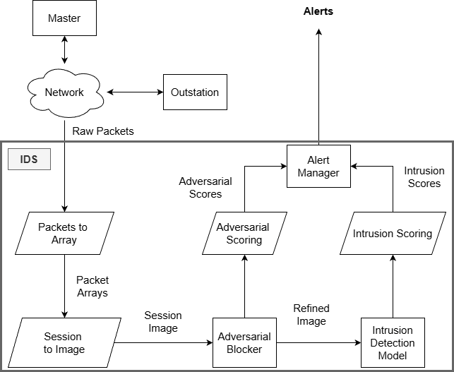
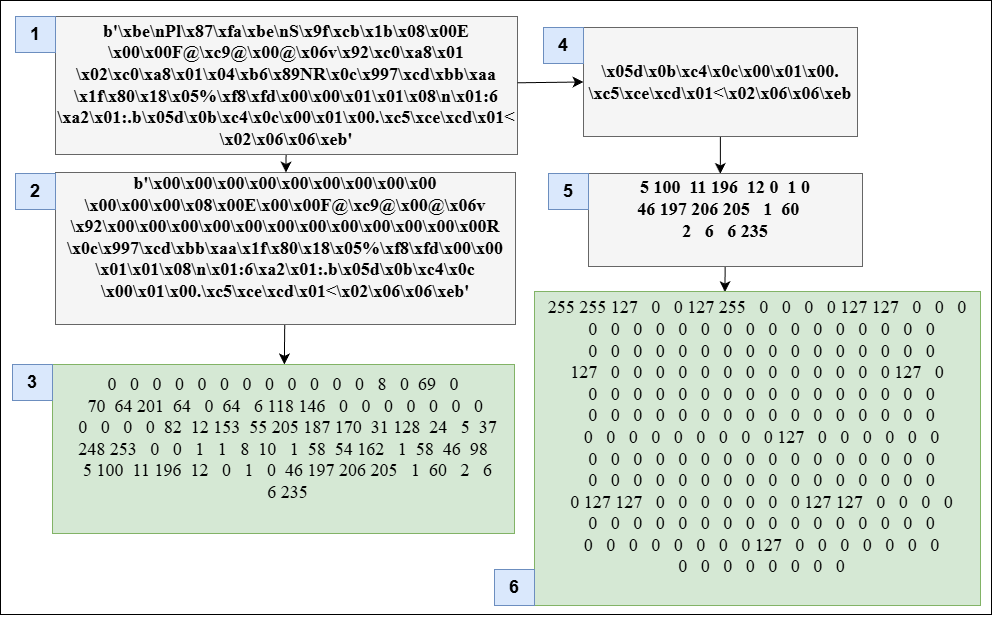
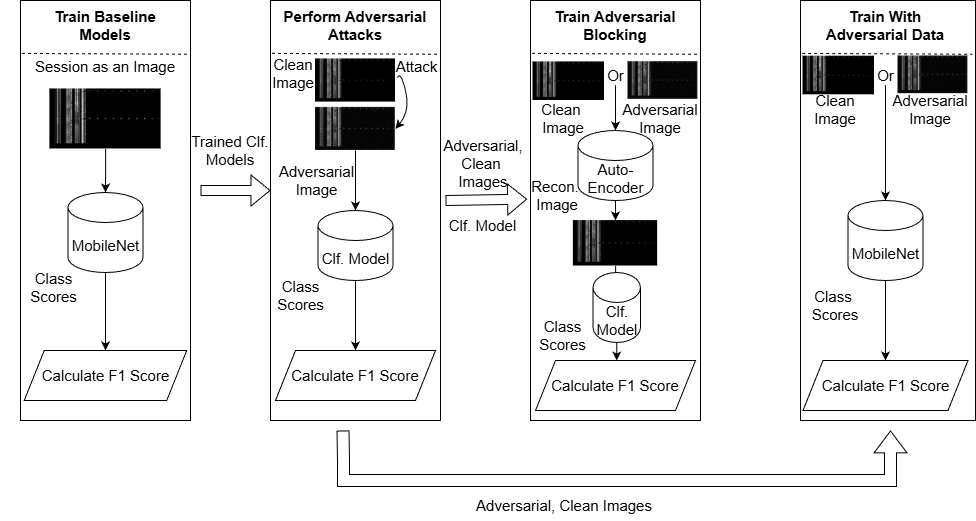

# Enhancing Smart Grid Security: A Deep Learning Approach to Adversarial Intrusion Detection

Proposed IDS flow diagram.

## Setting Up
1. Download the dataset DNP3 Intrusion Detection Dataset from [Zenodo](https://zenodo.org/records/7348493)
2. Unzip and copy all the CSV files related to CICFlowmeter and paste them into a single folder.
3. These files will be the main data files.
4. Read all files and combine them into a single CSV file. Relevant [script](feature_importance/combine_csv.py).
5. Install this project as `pip install -e .` and all its requirements too.

## PCAP to Image

A packet for the array creation steps.

* Read the CSV file for 120s Timeout and the corresponding PCAP files.
* For each CSV:
    * Read each row.
    * Find the matching packets in the PCAP file.
    * Call matched packets session and assign the label to it.
    * Convert session to image.
* Main script is: [feature_importance/dnp3_pcap_to_img.py](feature_importance/dnp3_pcap_to_img.py), and all others are there when some experiments were done, but are not needed to reproduce the results. It needs a mapping file between CSV and PCAP file, and are inside [assets](assets/).

## Model Training
* PyTorch 2.5.0 with GPU.
* As MLFlow is being used for logging the parameters, the command `mlflow server` should be run before training a model. But for the HPC, it is disabled.
* Dataset for tabular data: [ids_expt/data/dataset.py](ids_expt/data/dataset.py).
* Dataset for session image data: [ids_expt/data/session_image_dataset.py](ids_expt/data/session_image_dataset.py).
* Trainer: [ids_expt/models/trainer.py](ids_expt/models/trainer.py). A single trainer to train all models, but this is used by other modules in [/trainers/](/trainers/).

### Baseline Model Training
* First baseline model is from the [Data Authors](https://ieeexplore.ieee.org/document/9881726).
* Then [trainers/fnn_trainer.py](trainers/fnn_trainer.py). **It also trains CNN1D.** 
* Arguments can be passed. Slurm file: [jobs/tabular_trainer2.slurm](jobs/tabular_trainer2.slurm)

### Image-Based Model Training
* [trainers/session_image_trainer_backbone.py](trainers/session_image_trainer_backbone.py) trains the MobileNet or ResNet-based attack classifiers based on session images. 
* Arguments can be passed. Slurm file: [jobs/mobilenet_trainer.slurm](jobs/mobilenet_trainer.slurm)
* ResNet18 could also be used, but not necessary. Why? Because MobileNet is already better.

### Adversarial Generation
* [adversarial/generate_adversarial_image.py](adversarial/generate_adversarial_image.py) generates the adversarial data using the session images and trained models.
* Arguments can be passed. Slurm file: [jobs/adversarial_generator_mobilenet.slurm](jobs/adversarial_generator_mobilenet.slurm).

## Evaluation

A proposed evaluation plan.

All files are inside [adversarial](adversarial).
* A notebook [notebooks/image_feature_importance.ipynb](notebooks/image_feature_importance.ipynb) generates saliency map.
* [adversarial/evaluate_from_generated_mobnet.py](adversarial/evaluate_from_generated_mobnet.py) evaluates the adversarial image sample generated in previous step.
* [adversarial/evaluate_from_generated_tabular.py](adversarial/evaluate_from_generated_tabular.py) evaluates the adversarial tabular sample generated in previous step.
* For benchmarking, [adversarial/benchmark.py](adversarial/benchmark.py) for image based IDS models and [adversarial/benchmark_tabular.py](adversarial/benchmark_tabular.py) for tabular IDS.

These evaluation files create result CSV files (and sample images).

### Generating Plots
* Using [notebooks/report_generation_mobnetonly.ipynb](notebooks/report_generation_mobnetonly.ipynb) for image based IDS.
* Using [notebooks/report_generation_tabular.ipynb](notebooks/report_generation_tabular.ipynb) for tabular.

## Debug on HPC
* `salloc.tinygpu --gres=gpu:1 --time=01:00:00`
* `srun --jobid=1134289 --overlap --pty /bin/bash -l`
* `tqdm` should be disabled in HPC.
* Quota: `shownicerquota.pl`

## Misc Experiments
**These are not being used in the final paper and presentation. Because these are only for tabular and later focus turned into image based IDS.** 

### Feature Importance
First, the goal was to find the best feature importance extractor method. **Feature importance could vary for each attack.** Methods experimented with are:
* AutoEncoder: Implemented in [feature_importance/run_ae.py](feature_importance/run_ae.py). 
* PCA: Implemented in [feature_importance/run_pca.py](feature_importance/run_pca.py)
* [Permutation Feature Importance](https://christophm.github.io/interpretable-ml-book/feature-importance.html): Implemented in [feature_importance/run_pfi.py](feature_importance/run_pfi.py).
* Recursive Feature Elimination: Implemented in [feature_importance/run_rfe.py](feature_importance/run_rfe.py)

The best one was PFI. A visualisation is available in notebook [notebooks/feature_importance.ipynb](notebooks/feature_importance.ipynb), esp. in section **Read Previous Results**.

[This](https://pmc.ncbi.nlm.nih.gov/articles/PMC8323609/pdf/nihms-1670270.pdf) is also a good read. 

### Imbalance Handling
* Synthetic Data generation to oversample data based on [CTGAN](https://arxiv.org/html/2410.16326v1). 
* Here, we loop through each label and generate the synthetic dataset needed. 
* So for each attack label, there is one CTGAN model.
* CTGAN can be installed from [here](https://github.com/sdv-dev/CTGAN).

### Classification in Tabular Data
* `tabpfn` looks great. `pip install "tabpfn-extensions[all] @ git+https://github.com/PriorLabs/tabpfn-extensions.git"`

### Reproducing Results
An attempt was made to reproduce results from some research work done on tabular data. See notebook [notebooks/reproducing_results.ipynb](notebooks/reproducing_results.ipynb).
